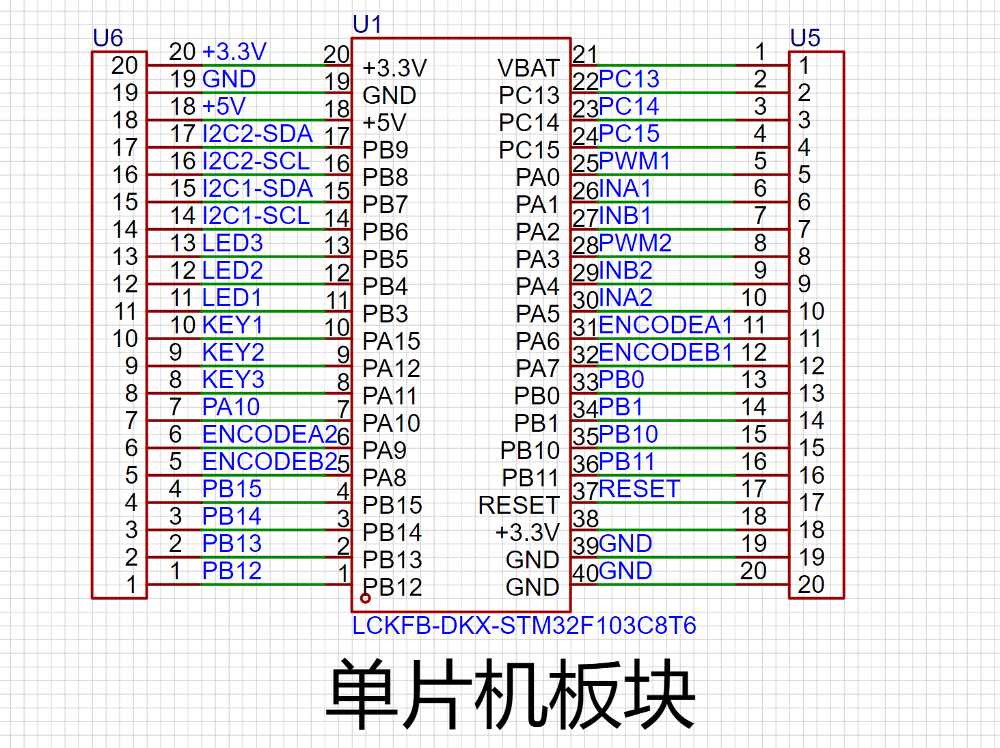

引脚分配：
定时器资源分配：TIM2的CH1与CH4（A0，A3）用作电机PWM<br>TIM3的CH1与CH2（A6，A7）用作编码器1的速度读取，TIM1的CH1和CH2（A8，A9）用作编码器2的速度读取。
LED部分，为共阴极接法。按键部分，为共阴极接法。
PB3，PA15为仿真器特殊IO口，需进行如下配置：
```C
//打开PA,B口时钟,AFIO复用时钟
RCC_APB2PeriphClockCmd(RCC_APB2Periph_GPIOA, ENABLE);
RCC_APB2PeriphClockCmd(RCC_APB2Periph_GPIOB, ENABLE);
RCC_APB2PeriphClockCmd(RCC_APB2Periph_AFIO, ENABLE);

//如果将五个引脚当做普通IO口，那么重映射配置应写为(会锁芯片)
GPIO_PinRemapConfig(GPIO_Remap_SWJ_Disable, ENABLE);

//如果用B3,B4,A15做普通IO,A13&14用于SWD调试,则重映射配置应写为：
GPIO_PinRemapConfig(GPIO_Remap_SWJ_JTAGDisable, ENABLE); 

//配置只用PB4可为普通IO口:
GPIO_PinRemapConfig(GPIO_Remap_SWJ_NoJTRST, ENABLE); 
```
编码器读取速率为160Hz，即单位时间为6.25ms，电机传动比为102.08:1，编码器每转计数64个，即电机输出轴转一圈编码器计数64000，PWM部分
